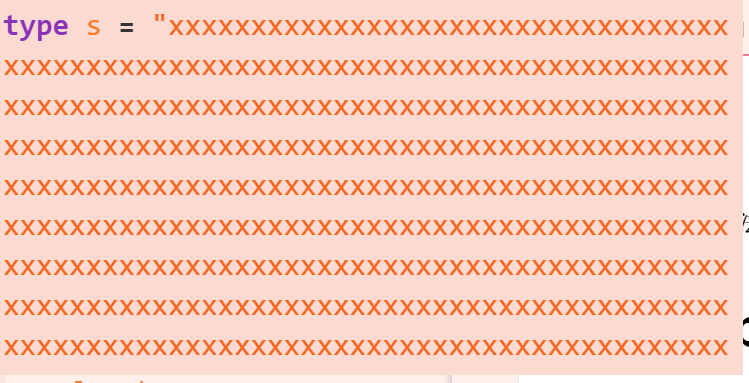
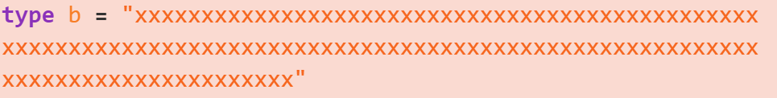

**[中文](#说明)**
[English](#Description)

**锚点链接可能无法工作，中文说明在下方**


# Description
**Packages for typescript metaprogramming**

The functionality has several major components:
1. **Logic**, including generic comparison templates such as If Equal and a complete mathematical logic system based on and non-operational
2. **Math**, based on string implementation, support for natural number operations, up to about 12-bit mathematical operations, with two kinds of representation, binary string representation and internal representation (SNum), providing conversion templates, conversion to internal representation can be calculated and compared to make up for the inadequacy of typescript metaprogramming does not support number operations. **Supports the addition, subtraction, multiplication and division of the quadratic arithmetic operations, supports the comparison of numbers greater than or less than or equal to the results of digital comparisons compatible with the logic system, can be used directly for control flow**
3. **array operations** , support for type mapping of array elements , add delete , etc. , including **typescript-tuple** package most of the functionality of **while supporting Filter, Zip and other common operations** .
4. **object types**, support for object type mapping and fusion, where fusion is a custom fusion policy, the actual object fusion function should be implemented by yourself, according to a predefined fusion policy, such as the name array attributes should be concat or mixed, should not be replaced, the same name attribute will be converted to A|B type, etc.
5. **Type manipulation**, mainly type mapper, type mapping representation unit, MapUnit, null type None, can be used to map various types, can provide an array such as [[a,b], [b,c], [c,d]] used to represent mapping rules, can be used to convert model types such as crawler to content types (combined with object type manipulation section)
6. **string manipulation**, currently implemented JOIN and Split, the future will add more operations
# Caution
Logic does not use normal true and false in the system, but uses **[true]**,**[false]** to facilitate multi-bit arithmetic.
**All logical operations can be performed simultaneously on a boolean array**.
# Function examples
## Array manipulation
**including ordinary add-delete-change, including two special Remove series of functions, can be realized from behind or in front of the excision of a paragraph of the same sequence, return the rest, with MapElement and Filter two collection of operational functions, including Filter supporting a series of judgment templates, such as DeleteSome function, the following string filtering function demo is used This function**
```ts
type a=Push<[1,2],1>;
type b=Concat<a,a>;
type c=Concat<b,b>;
type d=Shift<c,3>;
type e=RemoveEnd<d,[1,2,1]>. type f=Tail<e>; type d=Shift<c,3>; type e=RemoveEnd<d,[1,2,1]>;
type f=Tail<e>;
//type f = [1, 2, 1, 1, 2, 1, 1, 2, 1]
type h=MapElement<f,[[1,5],[2, "hello"]]>
//type h = [5, "hello", 5, "hello", 5, "hello", 5, "hello", 5]
```
## String filtering
```ts
//This is an array operation.
type aaa=Filter<["", "a",""],DeleteSome<[""]>>
//aaa=["a"]
```

## String merging and splitting
```ts
type a=JOIN<["aaaa", "bbbb"],",">//a="aaaabbbb"
type b=Split<"aaa","">;//b=["a", "a", "a"]
type c=Split<"aaa,bbb","">;//a = ["aaa", "bbb"]
```

## Array type mapping
```ts

type a=MapElement<[1,2,3,4], [[4,1],[1,2],[2,3],[3,4]]>;
//type a = [2, 3, 4, 1]
```

## Recursive mapping of object types
```ts
type s=MapRecursion<{
    a:string; b:number;
    test:{
        b:string;
    }
}, [[string, number],[number, string]]>; 
/**
type s = {
    a: number;
    b: string;
    test: {
        b: number;
        }
};

*/
```
**Note that MapElement and its alias MapProp can be used to perform single-level implication of Object's attribute types**.
## Numbers and comparisons
**Special values: Zero, One, all operations start with lowercase s, including three comparisons > < =, quadratic operations, with the extends statement can implement complex custom formulas**.
```ts
type a=BinToSNum<"1110001">
type b=BinToSNum<"1001">
type s=sMul<a,b>
type isok=sEqual<s,BinToSNum<"111111001">>;
type n=If<isok, "hello", "world">>; type n=If<isok, "hello", "world">
//type n = "hello"
//In this case, s is a string of 1017 x's.
```

## Base conversion
```ts
type a=OCT<"176">
type b=BinToSNum<a>
```


## Typed nested classes based on number crunching
**currently measured up to 23 layers of nesting, nesting process does not lose type**
```ts
class test<A extends string,H=(sEqual<A,Zero> extends [false]? test<sDec<A>>>:void)>{
    get test():H{
        return null as unknown as H;
    }
    public hello():(H extends void? "hello": "word"){
        return "" as unknown as any;
    }
}

// 23 heavy types It seems that nesting can only nest 23 layers.
let a=new test<BinToSNum<"10111">>()
a.test.test.test.test.hello();
```

## Logic control
Note that before using control flow templates such as If, you should consider whether the evaluation is **recursive**, because the parameters passed such as templates are **pre-calculated**, and the extends operation is **short-circuited**, using If instead of extends may lead to **infinite recursion **problems, it is recommended to use control flow templates such as If in the case that **then** and **else** are directly evaluable.
```ts
type ttt<b,c>=If<Equal<b,c>, "hello", "world">;
type s=ttt<1,2>;
//type s = "world"
```
**Use control flow with caution and do not use it instead of extends statements in the definition of recursive types**

## Logical operations
Logical operations including, with or without, different or same as or, implicit, equivalence (biconditional), theoretically can be used to implement the propositional logic system, due to the lack of support for generic directly as type variables passed, **currently can not support the predicate logic**, can only use a limited number of **ALL**,**ANY** operations instead.
**Note that EQ and XNOR are defined differently; XNOR is defined based on the XOR operation and EQ is defined based on the INFER operation, and the following code proves that it is constant**
```ts
type a<b,c>=EQ<EQ<b,c>,XNOR<b,c>>;
type tt=[a<[false],[false]>,a<[true],[false]>,a<[false],[true]>,a<[true],[true]>];
//tt=[[true],[true],[true],[true]]
// It follows that a is a perpetual truth, i.e., EQ is always equal to XNOR
//((a->b) and (b->a))<->(not(a^b))
type a=ANY<[true,false,false]>;
type b=ALL<[true,false,false]>;
//a=[true[ b=[false]
```

# Plan description
This package is a metaprogramming package, and will include various related packages in the future, the next step is to include typescript-tuple.


# 1.0-alpha-Re1 version update content
**Attention, this version has destructive content, please be mentally prepared before upgrading**
1. **Increase**: Incorporates the beneficial content of typescript-tuple and typescript-logic packages
2. **Increase**:
   1. The DEC function has been added, and the hexadecimal conversion based on multiplication instead of string splicing has been tried. **The upper limit of the OCT function has not been solved, but the DEC function is basically available, and there is basically no upper limit problem**
   2. The Num function has been added, which can convert SNum into a normal number, but due to the recursion depth limit of the Split function, there are great limitations. Only small numbers are supported, and the maximum can only reach a dozen.
3. **Increase**:
   1. The array part adds a string operation part and a search part, including replacement and removal, and new functions:
      1. IndexOf search function, you can get the substring position
      2. Add Replace series functions
      3. Add functions to remove content in the middle, RemoveSame and RemoveAllSame
   2. Add Skip function to the set operation section
4. **Modification**: Some functions have been added to the array operation section, and the names of some functions have been modified. **Please upgrade carefully here**
5. **Modification**: The meaning of the OCT function has been changed. Now all the hexadecimal conversion functions directly output SNum, which can be used directly
## 1.x version update plan
1. Improve the math part
   1. Support the conversion from SNum to Bin and Logic, mainly to convert to Logic and then to Bin
   2. Support decimal system, through the conversion from SNum to Bin, the conversion from decimal to binary is realized through calculation, and SNum can be defined by decimal
   3. Support hexadecimal, solve the bug that can only support up to 12 digits, and solve the hidden dangers of the MapType system
2. The depth limitation problem of MapType, that is, the limitation of the number of items in the mapping table. Consider solving the depth problem through binary matching. This may rely on the improvement of the Array system, including the Get Slice Concat and Insert functions, which will be implemented with the support of the mathematical system
3. Add the actual implementation of the Merge function to implement the Merge type fusion strategy, instead of the general assign function
4. Implement a type guard system integrated with the type system, such as arr obj num str many date, etc., you can directly use the object definition to define the type, and get the final actual type through the type mapping function, and you can use the type verification tool. Perform type check and detection according to the defined type guard object, materialize the type of typescript and fully support editor prompts
5. Replace some operations with the content in the typescript-tuple package
6. **Apply all the functions of array manipulation to the string module through JOIN and Split functions**
7. Array operation part, based on SNum system to implement various position-based operations, including Get Slice Insert, etc.
8. Use dichotomy to implement the sDiv function instead of counting
9. Increase instead of function, for sNum, introduce array operation capability
10. Continue to absorb the content and useful parts of similar packages
## 2.x version pre-plan
1. Add a new module to solve various problems caused by the inability to support predicate logic, that is, it is impossible to directly pass a parameter-free generic, that is, the problem of a generic function as a first-class citizen. Generics, use generic reference tables, and implement addressing through string
2. Improve the foundation of SNum, from string implementation to more optimized other ways
3. Realize various extraction and judgment packaging operations for Promise Iterator Iterable AsyncIterable and other systems that come with generic types
4. Consider supporting recursive types, based on mathematical systems
5. (To be determined) Add new modules to implement a complete AST system, support direct code analysis to obtain AST, prepare to support high-level languages
6. (To be determined) Add an assembly instruction support system, support assembly instructions, and prepare for future support of high-level languages
7. (To be determined) Add new functions based on assembly instructions and high-level languages, including many functions that could not be achieved before
8. (To be determined) Before supporting assembly, consider first supporting a lisp-like language
9. (To be determined) Support the realization of various data structures in the type system
10. (To be determined) Use KMP algorithm to implement string search, etc., may be based on high-level language support, and implement some common algorithms with a type system, such as the shortest path and game tree, etc.
# Compare
Comparison with common packages:
1. typescript-logic: unit logic. The implementation principle is similar to the logic part of this package. It can be repackaged to perform element-wise operations on the array to convert to multiple bits, but each operation must be packaged, and it does not define the INFER EQ operation , And is not compatible with the digital computing system of this package
2. typescript-tuple: absorb the array operation part of it, and absorb the digital control method in it, and establish a new mathematical operation mechanism


# 说明
**typescript元编程使用的包**

功能有几大部分:
1. **逻辑**，包括If Equal 等通用比较模板和完整的基于与非运算的数理逻辑系统
2. **数学**，基于字符串实现，支持自然数运算，最高支持12位左右的数学运算，拥有2种表示方式，二进制字符串表示和内部表示（SNum），提供转换模板，转换为内部表示后可进行计算和比较，弥补typescript元编程不支持数字运算的不足。**支持加减乘除四则运算，支持大于小于等于的数字比较，数字比较的结果与逻辑系统兼容，可直接用于控制流**
3. **数组操作**，支持对数组元素进行类型映射，添加删除等，,包括**typescript-tuple**包的大部分功能，**同时支持Filter，Zip等常见操作**
4. **对象类型**，支持对象类型的映射和融合，其中融合为自定义的融合策略，实际对象融合函数需要自己实现，按照预定义的融合策略来，如同名数组属性应该concat或混合，不应该替换，同名属性会被转换为 A|B类型等
5. **类型操作**，主要是类型映射器，类型映射表示单元，MapUnit，空值类型None，可用于对各种类型进行映射，可提供一个如[[a,b],[b,c],[c,d]]的数组用于表示映射规则，可实现爬虫等model类型到内容类型的转换（结合对象类型操作部分）
6. **字符串操作**,目前实现的有JOIN和Split,未来将加入更多操作
# 注意事项
**Logic系统中不使用普通的true和false，而使用[true],[false]，方便多位运算**
**所有的逻辑操作都可同时对一个boolean数组执行**
# 功能示例
## 数组操作
**包括普通的增删改查，包括两个特殊的Remove系列函数，可实现从后面或前面切除一段同样的序列，返回剩下的,拥有MapElement和Filter 两个集合操作函数，其中Filter配套有一系列判断模板，如DeleteSome函数,下方字符串过滤功能演示用到了此函数**
```ts
type a=Push<[1,2],1>;
type b=Concat<a,a>;
type c=Concat<b,b>;
type d=Shift<c,3>;
type e=RemoveEnd<d,[1,2,1]>;
type f=Tail<e>;
//type f = [1, 2, 1, 1, 2, 1, 1, 2, 1]
type h=MapElement<f,[[1,5],[2,"hello"]]>
//type h = [5, "hello", 5, 5, "hello", 5, 5, "hello", 5]
```
## 字符串过滤
```ts
//此为数组操作
type aaa=Filter<["","a",""],DeleteSome<[""]>>
//aaa=["a"]
```

## 字符串合并与拆分
```ts
type a=JOIN<["aaaa","bbbb"],",">//a="aaaabbbbb"
type b=Split<"aaa","">;//b=["a","a","a"]
type c=Split<"aaa,bbb","">;//a = ["aaa", "bbb"]
```

## 数组类型映射
```ts

type a=MapElement<[1,2,3,4],[[4,1],[1,2],[2,3],[3,4]]>;
//type a = [2, 3, 4, 1]
```

## 对象类型递归映射
```ts
type s=MapRecursion<{
    a:string;
    b:number;
    test:{
        b:string;
    }
},[[string,number],[number,string]]>; 
/**
 type s = {
    a: number;
    b: string;
    test: {
        b: number;
        }
};

*/
```
**注意，MapElement和其别名MapProp 可用于对Object的属性类型进行单层隐射**
## 数字与比较
**特殊值有：Zero，One ，所有运算都以小写s开头，包括三个比较运算 ＞ ＜ ＝，四则运算，配合extends语句可实现复杂的自定义公式**
```ts
type a=BinToSNum<"1110001">
type b=BinToSNum<"1001">
type s=sMul<a,b>
type isok=sEqual<s,BinToSNum<"1111111001">>;
type n=If<isok,"hello","world">
//type n = "hello"
//此时s为1017个x组成的字符串
```


## 进制转换
```ts
type a=OCT<"176">
type b=BinToSNum<a>
```


## 基于数字计算的有类型嵌套类
**目前测得可最多嵌套23层,嵌套过程中不丢失类型**
```ts
class test<A extends string,H=(sEqual<A,Zero> extends [false]? test<sDec<A>>:void)>{
    get test():H{
        return null as unknown as  H;
    }
    public hello():(H extends void? "hello":"word"){
        return "" as unknown as any;
    }
}

//23重类型 似乎嵌套只能嵌套23层
let a=new test<BinToSNum<"10111">>()
a.test.test.test.test.test.test.test.test.test.test.hello();
```

## 逻辑控制
**注意，使用If等控制流模板前，应该考虑求值是否递归，因为传递如模板的参数，都会预先计算好，而extends运算是短路的，使用If代替extends可能导致无穷递归问题，建议在then和else是可直接求值的情况下，使用If等控制流模板**
```ts
type ttt<b,c>=If<Equal<b,c>,"hello","world">;
type s=ttt<1,2>;
//type s = "world"
```
**请谨慎使用控制流，切勿在递归类型的定义中使用控制流代替extends语句**

## 逻辑运算
**逻辑运算包括，与或非，异或同或，蕴含式，等价式（双条件式），理论上可用于实现命题逻辑系统，由于不支持泛型直接作为类型变量传递，目前无法支持谓词逻辑，只能使用有限的ALL,ANY运算代替**
**注意，EQ和XNOR的定义不同，XNOR基于XOR运算定义，EQ基于INFER运算定义，以下代码证明其恒定**
```ts
type a<b,c>=EQ<EQ<b,c>,XNOR<b,c>>;
type tt=[a<[false],[false]>,a<[true],[false]>,a<[false],[true]>,a<[true],[true]>];
//tt=[[true],[true],[true],[true]]
//由此可知，a为永真式，即EQ恒等于XNOR
//((a->b) and (b->a))<->(not(a^b))
type a=ANY<[true,false,false]>;
type b=ALL<[true,false,false]>;
//a=[true[ b=[false]
```

# 计划说明
本包为元编程支持包，未来会吸纳各种相关包到其中，下一步将会把typescript-tuple包括进来

# 1.0-alpha-Re1 版本更新内容
**注意，此版本有破坏性内容，升级前请做好心理准备**
1. **增加**:吸纳了typescript-tuple和typescript-logic包的有益内容
2. **增加**:
   1. 增加了DEC函数,尝试了基于乘法而非字符串拼接的进制转换,**OCT函数的上限问题尚未解决,但DEC函数基本可用,基本无上限问题**
   2. 增加了Num函数,可以把SNum转化为普通number,但由于Split函数的递归深度限制,存在很大的局限性,只支持较小的数字,最高只能到十几
3. **增加**:
   1. 数组部分增加了串操作部分和搜索部分,包括替换和移除,新增函数:
      1. IndexOf搜索函数，可以得到子串位置
      2. 增加Replace系列函数
      3. 增加中间移除内容的函数,RemoveSame 和RemoveAllSame
   2. 集合操作部分添加Skip函数
4. **修改**:数组操作部分增加了一些功能，并修改了部分函数的名字,**此处请谨慎升级**
5. **修改**:更改了OCT函数的含义,现在所有进制转换函数都直接输出SNum,可直接使用
## 1.x 版本更新计划
1. 改进数学部分
   1. 支持从SNum到Bin和Logic的转换,主要是转化到Logic然后到Bin
   2. 支持十进制,借由从SNum到Bin的转化,通过计算实现10进制到2进制的转化,并可通过十进制定义SNum
   3. 支持16进制,解决最高只能支持到12位数字的Bug,解决MapType系统的隐患
2. MapType的深度限制问题,即映射表Item数量限制问题,考虑通过二分方法匹配解决深度问题,这可能依赖Array系统的改进,包括 Get Slice Concat 和Insert函数,这些函数将在数学系统支持下实现
3. 添加Merge函数的实际实现,实现Merge类型的融合策略,代替一般的assign函数
4. 实现一个与类型系统整合的type guard 系统,如arr obj num str many date等等,可直接使用对象定义来定义类型,并通过类型映射函数得到最终实际类型,并可通过类型校验工具,根据定义的type guard对象进行类型校验和检测,将typescript的类型实体化并完整支持编辑器提示 
5. 将一些操作使用typescript-tuple包中的内容替代
6. **将数组操作的功能，通过JOIN和Split函数，全部应用到string模块中**
7. 数组操作部分,基于SNum系统实现各种基于位置的操作,包括Get  Slice Insert 等
8. 将sDiv函数使用二分法实现,而非使用计数法
9. 增加而非函数,对sNum,引入数组操作能力
10. 持续吸纳同类包的内容和有益部分
## 2.x 版本预计划
1. 添加新模块,解决到各种由于无法支持谓词逻辑而导致的问题,即无法直接传递一个无参泛型,也即泛型函数作为一等公民的问题,目前考虑对系统内部的各种泛型,使用泛型引用表,通过string进行寻址实现
2. 改进SNum的基础,从string实现到更优化的其他方式实现
3. 实现对Promise Iterator Iterable AsyncIterable等系统自带泛型类型的各种提取判断包装操作
4. 考虑对递归类型进行支持,基于数学系统
5. (待定)添加新模块,实现一个完整的AST系统,支持直接对代码进行解析得到AST,准备支持高级语言
6. (待定)添加一个汇编指令支持系统,支持汇编指令,为未来支持高级语言做准备
7. (待定)添加基于汇编指令和高级语言的新功能,包括很多以前无法实现的功能
8. (待定)在支持汇编前,考虑先对一个类lisp语言进行支持
9. (待定)支持各种数据结构在类型系统中的实现
10. (待定)把字符串搜索等使用KMP算法等实现，可能基于高级语言支持,将一些常见算法用类型系统实现,如最短路和博弈树等
# 比较
与常用包的比较:
1. typescript-logic :单位逻辑，实现原理与本包logic部分类似，可通过重新包装，对数组进行element-wise操作转换为多位，但每个运算都要包装，且其没有定义INFER EQ操作，同时无法与本包的数字运算体系兼容
2. typescript-tuple: 吸纳其中的数组操作部分,并吸取其中的数字控制方法,建立一个新的数学运算机制